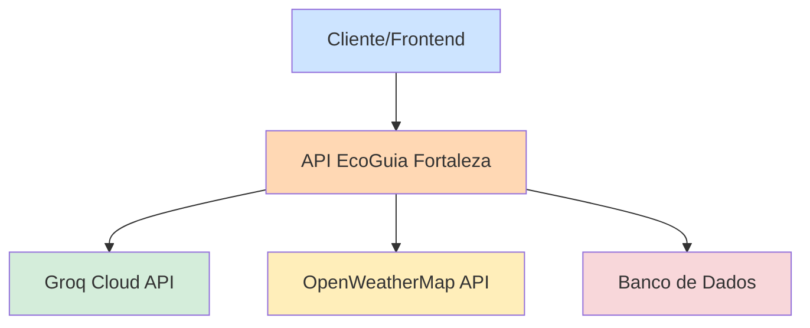

# 🌿 EcoGuia Fortaleza - API

API de integração para um assistente virtual de sustentabilidade urbana, oferecendo orientações sobre práticas sustentáveis, descarte correto de resíduos e agricultura urbana na cidade de Fortaleza.

## 📋 Índice

- [Objetivo](#-objetivo)
- [Problema Social](#-problema-social)
- [Descrição da Solução](#-descrição-da-solução)
- [Sistemas Integrados](#-sistemas-integrados)
- [Arquitetura da API](#-arquitetura-da-api)
- [Funcionalidades](#-funcionalidades)
- [Tecnologias Utilizadas](#-tecnologias-utilizadas)
- [Como Executar](#-como-executar)
- [Documentação da API](#-documentação-da-api)
- [Testes](#-testes)
- [Relacionamento com ODS 11](#-relacionamento-com-ods-11)
- [Equipe](#-equipe)
- [Licença](#-licença)

## 🎯 Objetivo

Desenvolver uma API de integração que permita a comunicação entre sistemas heterogêneos para promover práticas sustentáveis em Fortaleza, facilitando o acesso à informação sobre descarte correto, agricultura urbana e conservação ambiental.

## 🌍 Problema Social

Fortaleza enfrenta desafios significativos na gestão de resíduos sólidos e na conscientização ambiental da população. Muitos materiais recicláveis são descartados incorretamente devido à falta de informação sobre pontos de coleta e procedimentos adequados, impactando negativamente o meio ambiente e a saúde pública.

## 💡 Descrição da Solução

O EcoGuia Fortaleza é uma API que integra inteligência artificial com dados contextualizados para fornecer orientações personalizadas sobre:
- Práticas de descarte correto de resíduos
- Técnicas de agricultura urbana
- Informações sobre pontos de coleta em Fortaleza
- Dicas de sustentabilidade adaptadas ao contexto local

## 🔗 Sistemas Integrados

1. **Sistema de Backend Proprietário** - API desenvolvida em Node.js/Express
2. **Sistema de Inteligência Artificial** - Groq Cloud API (LLM)
3. **Sistema de Dados Climáticos** - OpenWeatherMap API (opcional)

## 🏗️ Arquitetura da API



## ⚙️ Funcionalidades

- **Chatbot de Sustentabilidade**: Responde perguntas sobre práticas ambientais
- **Health Check**: Verificação do status da API
- **Tratamento de Erros**: Respostas padronizadas para diferentes cenários de erro
- **Logs de Operação**: Registro das atividades da API

## 🛠️ Tecnologias Utilizadas

- **Node.js** - Ambiente de execução JavaScript
- **Express.js** - Framework web para Node.js
- **Groq SDK** - Integração com API de linguagem natural
- **Jest** - Framework de testes
- **Supertest** - Testes de integração HTTP
- **dotenv** - Gerenciamento de variáveis de ambiente

## 🚀 Como Executar

### Pré-requisitos

- Node.js 16+
- npm ou yarn
- Chave de API da Groq Cloud

### Instalação

1. Clone o repositório:
```bash
git clone https://github.com/seu-usuario/ecoguia-fortaleza-api.git
cd ecoguia-fortaleza-api
```

2. Instale as dependências:
```bash
npm install
```

3. Configure as variáveis de ambiente:
```bash
cp .env.example .env
# Edite o arquivo .env com suas chaves de API
```

4. Execute a API:
```bash
# Desenvolvimento
npm run dev

# Produção
npm start
```

5. Execute os testes:
```bash
npm test
```

## 📡 Documentação da API

### Endpoints

#### POST /api/ask
Recebe perguntas sobre sustentabilidade e retorna respostas contextualizadas.

**Request:**
```json
{
  "question": "Como descartar óleo de cozinha em Fortaleza?"
}
```

**Response:**
```json
{
  "resposta": "Em Fortaleza, você pode descartar óleo de cozinha usado em...",
  "status": "success"
}
```

#### GET /api/health
Verifica o status da API.

**Response:**
```json
{
  "status": "OK",
  "timestamp": "2024-09-25T10:00:00.000Z",
  "version": "1.0.0"
}
```

#### GET /api/weather
Busca informações do clima de Fortaleza.

**Response:**
```json
{
    "temp": 29.97,
    "feels_like": 32.39,
    "description": "nuvens dispersas",
    "city": "Fortaleza",
    "sustainability_tip": "Ótimo dia para praticar sustentabilidade! Considere usar transporte alternativo.",
    "message": "Dados climáticos de Fortaleza"
}
```

### Códigos de Status HTTP

- `200` - Sucesso
- `400` - Requisição inválida
- `500` - Erro interno do servidor

## 🧪 Testes

A API inclui testes unitários e de integração:

```bash
# Executar todos os testes
npm test

# Executar testes com coverage
npm run test:coverage
```

## 🌱 Relacionamento com ODS 11

Este projeto contribui diretamente com o **Objetivo de Desenvolvimento Sustentável 11 - Cidades e Comunidades Sustentáveis** através de:

- **Meta 11.6**: Reduzir o impacto ambiental negativo per capita das cidades, prestando especial atenção à qualidade do ar, gestão de resíduos municipais e outros
- **Meta 11.b**: Aumentar o número de cidades e assentamentos humanos adotando e implementando políticas e planos integrados para a inclusão, a eficiência dos recursos, mitigação e adaptação às mudanças climáticas

A API promove práticas sustentáveis de gestão de resíduos e conscientização ambiental, alinhando-se com as metas de tornar as cidades mais inclusivas, seguras, resilientes e sustentáveis.

## 👥 Equipe

| Nome | Matrícula | Função |
|------|-----------|--------|
| Anyele Ventura Lima | 2323813 | Desenvolvimento Backend |
| Isadora Ianne Aguiar de Castro  |  2323864 | Integração de APIs |
| Silvanir Nascimento dos Santos | 2326784 | Documentação |
| Luiz Henrique Lopes | 2326254 | Testes |

## 📄 Licença

Este projeto é desenvolvido para fins acadêmicos como parte da disciplina Técnicas de Integração de Sistemas (N703).

---

**Entrega**: 29/09/2025  
**Disciplina**: Técnicas de Integração de Sistemas (N703)  
**Instituição**: [Unifor - Universidaade de Fortaleza]
